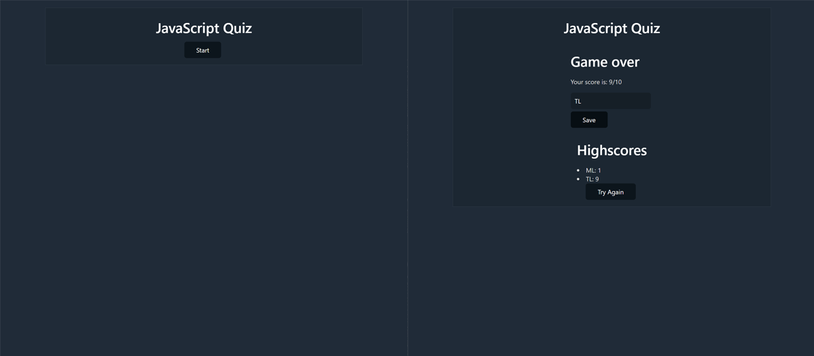

# Week 4 - Simple JavaScript Quiz

This week we were asked to design a simple quiz on JavaScript fundamentals aimed at other bootcamp students, using Javascript. The quiz was to be timed and have a scoring element, with a list of the high scores so you could effectively compare your results with your peers.

I decided to form the quiz on a single page, within a container. On loading the application you are presented only with a title and a start button. On clicking the start button, your are presented with a question and a list of multiple choices, and a timer appears counting down from 60.

When the correct answer is selected from the list, the user is provided feedback in the form of an alert, the score is logged, and the next question is loaded. If the answer is incorrect, the user also receives this feedback, but the score remains the same while 10 seconds is deducted from the current time.

When the timer runs out or all questions have been answered, a form appears to enter your initials. On submitting your initials, the highscores field is revealed, along with the option of restarting the quiz.

I used water.css to style the page as it's pleasing to the eye and served well for this challenge.

I'd just like to note this weeks challenge was my least favourite.. do with that information as you will lol.

You can view a working version of this application [here](https://github.com/mleftwich/JSQuiz)

